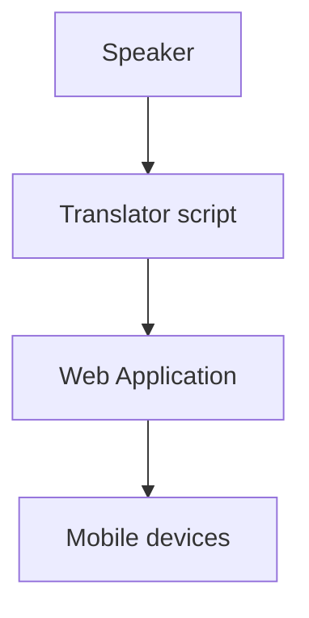

# live-translation
Translate the audio input using readily available machine learning tools and text-to-speech technology. 
This project is divided into parts, one stand alone Python script that collects the audio, translate and transfer the text to the web application.

