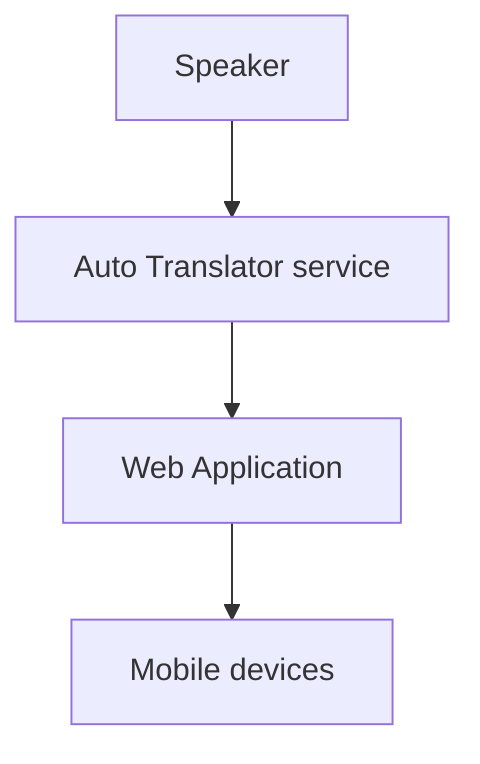
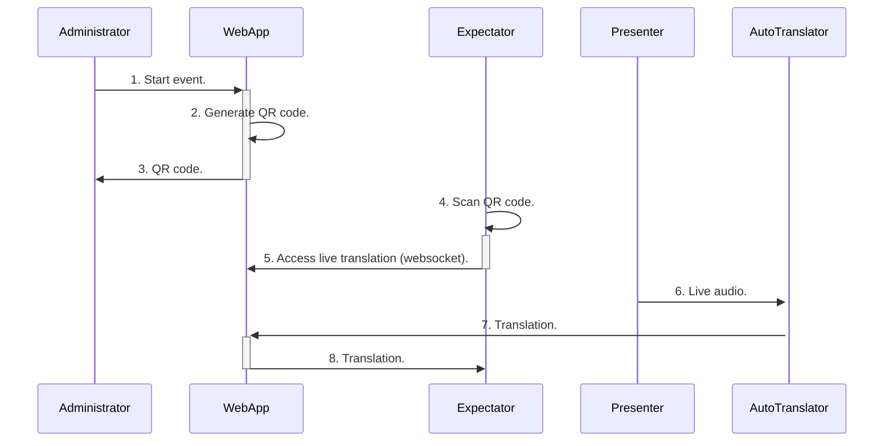

# live-translation
Translate the audio input using readily available machine learning tools and text-to-speech technology. 
This project is divided into parts, one stand alone Python script that collects the audio, translate and transfer the text to the web application.

## How does it work?

### Initialisation
The normal flow involves someone starting an live event and consequently generating a QR Code that points to the event.

### Access
Expectators interested in the translation of the event can scan the QR code and access the live translation.

### Broadcast
The Translator service will receive chunks of audio, translate then and transmit them to the Web Application and this one will broadcast to the connected expectators.

